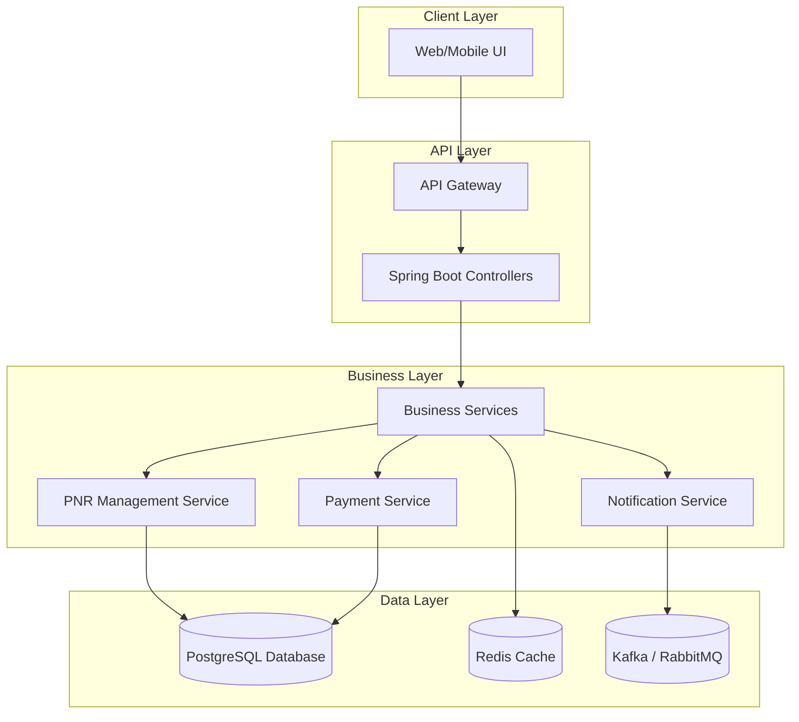

# Aero PNR Management
Hello, welcome to my GitHub. This project is a system to manage airline passenger records (PNRs), including customer and flight information.

I am building this project to create a backend system with Java Spring Boot for managing customers and products. My goal is to make a system that is simple, easy to maintain, and it can grow in the future. I'm planning to use modern architecture principles and clean code practices during development.

At the beginning, the main parts of the system will be;
- **Customer Service:** To manage customers (add, update, list)
- **Product Service:** To manage products (add, update, list) 
- **Order Service:** To manage orders and connect customers with products
- **API Gateway:** To handle requests and send them to the right service
- **Database Layer:** To save the data safely.

You can find the simple architecture diagram of the system below;

I will start by making basic CRUD operations for customers, products, and orders. After that, I want to add authentication and authorization. Later, I also want the services to communicate easily with each other and add logging and monitoring to the system.

This document shows the architecture that I'm trying to achieve. I will continue to develop step by step.
